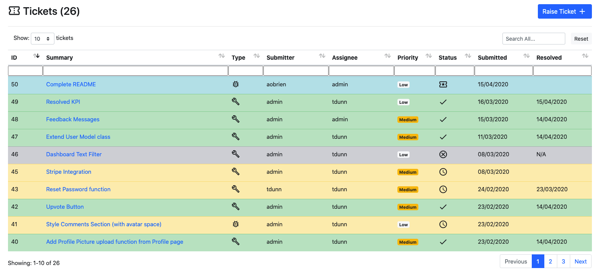
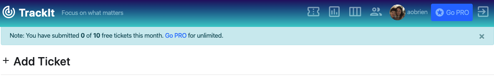
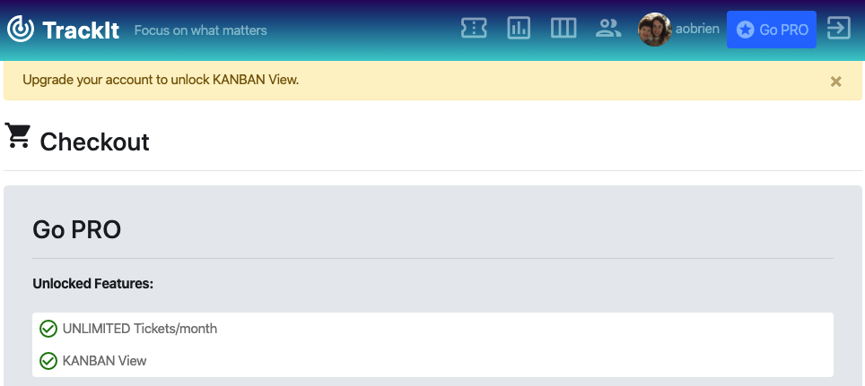
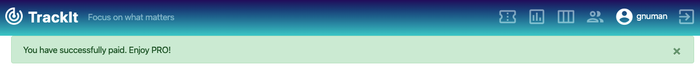

[](https://travis-ci.org/tdunn891/milestone-4)

# Milestone Project 4 - [TrackIt](https://django-issue-tracker-1.herokuapp.com/)


## Purpose

TrackIt was developed to provide organisations of all types an intuitive, lightweight system to log, track and resolve issues without the admin burden. In a live environment, this application would be deployed within an organisation. For example, a non-technical employee (Submitter) submits a 'Bug' to flag an internal software issue. A technical staff member (Assignee) is then assigned the Ticket and works to resolve. Or say an employee has a time-saving idea for a new software feature, they can submit a 'Feature Request' which is then assigned and tracked through to implementation. As proof of concept, the site itself was used track bugs and features during development.

## Contents

1. [**UX**](#ux)

   - [**5 Planes of UX**](#5-planes-of-ux)
   - [**User Stories**](#user-stories)

2. [**Features**](#features)

   - [**Existing Features**](#existing-features)
   - [**Potential Future Features**](#potential-future-features)

3. [**Databases**](#databases)

   - [**Data Models**](#data-models)
   - [**Data Migration**](#data-migration)

4. [**Technologies**](#technologies)

5. [**Testing**](#testing)

   - [**Automated Testing**](#unit-testing)
   - [**Manual Testing**](#manual-testing)
   - [**Code Validation**](#code-validation)
   - [**Audits**](#audits)

6. [**Deployment**](#deployment)

   - [**Heroku**](#heroku)
   - [**Local Deployment**](#local-deployment)
   - [**Development vs Production Versions**](#development-vs-production-versions)

7. [**Credits**](#credits)

   - [**Content**](#content)
   - [**Media**](#media)
   - [**Acknowledgements**](#acknowledgements)

## UX

### 5 Planes of UX

#### Strategy

Setting the UX strategy requires understanding the needs of the target users:

Ticket Submitters want:

- a straightforward ticket submission process
- feedback to be assured that their issue is being worked
- to spend minimal time on the site so they can return to their core tasks

Ticket Assignees want:

- Lots of detail about the ticket, including screenshots
- Input from other users who may be experiencing the same Bug or want the same Feature Request
- Ability to reassign to another Assignee if required
- Graphs to gain insights - for example High Priority or aging tickets that require attention

Taking the above into account, the User Experience must be clean, fast, and intuitive.

#### Scope

##### Functional Specifications

Existing issue trackers were researched (eg Jira, GitHub Issues) to identify key functionality users expect:

- Submitting and tracking of 'Bugs' and 'Feature Requests' through to resolution.
- Contributions from other users to speed up resolution.
- Dashboard View of all tickets
- KANBAN View

##### Content Requirements

- Data tables
- Input boxes for ticket filtering
- DC.js, D3.js and crossfilter for dashboard charts
- Dropdowns for selecting and editing fields
- File Upload buttons

#### Structure

##### Interaction Design

- Unobtrusive navigation bar, always accessible and fixed to top
- On mobile and tablet devices, navigation links collapse into a menu button
- All interactive elements provide feedback to the user to encourage interaction and confirm user actions
- Each row in tickets table changes opacity on hover
- Navigation and pagination links change opacity on hover
- All buttons have border transition on hover
- Tooltips on icons on hover
- Form validation exists for relevant fields
- Dropdown messages confirm: User Logged In , User Logged Out, Ticket Added, Ticket Edited, Ticket Upvoted, Comment Submitted, Payment Provided.

##### Information Architecture

- A multipage architecture was used to break up the large amount of information presented in the site. For example, the Add Ticket, Edit Ticket and Checkout pages require many fields and so require separate pages.
- Pagination is employed in the tickets table to reduce cognitive overload. User can select how many tickets to display per page via dropdown.

#### Skeleton

##### Wireframes

Two sets of wireframes were created in the early development stage to set out the structure and layout on different device sizes.

[Desktop & Mobile Wireframes](https://github.com/tdunn891/milestone-4/tree/master/wireframes)

#### Surface

Colours: Intuitive ticket colours used consistently to represent Ticket Status - Green: Resolved, Yellow: In Progress, Grey: Cancelled, Blue: New.

### User Stories

As a Guest User...

- I want to quickly learn the key features of the site
- I want to know if sign up is free and which features are behind a paywall
- I want to see a visual preview of the features before having to sign up
- I want to know if this site is credible and used by well-known organisations
- I want to see some customer testimonials
- I want my initial questions to be answered
- I want to be able to contact the developer for further information

As a Registered User...

- I want to submit a Feature Request that would improve my productivity
- I want to submit a Bug I am experiencing without being distracted from my core tasks
- I want to be able to check how many free tickets submissions I have remaining in the month on my Basic plan
- I want to see a list of all tickets I have raised
- I want the option to see all tickets in a KANBAN-style column view
- I want to contribute to the resolution of an open issue by leaving a comment under it
- I want to raise the profile of an existing ticket by upvoting it
- I want the ability to unlock PRO features via online credit card payment
- I want to control which personal information I share with other users
- I want to be able to upload a profile image so my colleagues can put a face to the name
- I want to access contact details of other users
- I want to be able to request Staff access

As a Registered Staff (Admin) User:

- I want to easily contact a ticket's Assignee by launching a draft email from the ticket view
- I want to graphically identify which tickets require attention, ie. aged and high priority tickets
- I want to see which tickets have the most upvotes, to help inform work prioritisation

## Features

### Pages

#### Home

The Home page provides a quick introduction to the site, featuring minimal, easy to digest sections on Features, User Testimonials, Trusted By, Plans and Frequently Asked Questions. If the user is not signed in, the call to action buttons are to **Create Free Account**. If the user is already signed in, their username and profile picture will be displayed in the navigation bar and links to the Account page. If the user is signed in but not a Pro User, the call to action buttons are to **Go PRO**, The Go PRO buttons link to the Checkout page, where the user can pay to upgrade their account.

#### Tickets

The Tickets page allows sorting and filtering of existing tickets, and a link to create a new ticket. The table shows key information for each ticket. Clicking on the row opens the **View Ticket** page for further details. Each field can be sorted both directions, and general and field-specific search input is available.



#### View Ticket

The View Ticket page provides additional ticket information, including the Description, Tags, Days to Resolve (if Resolved), Age (if not Resolved) and Recent Activity. If the user is the Submitter or Staff, the **Edit Ticket** and **Status** buttons will be displayed and the user will have permission to change the Status via the dropdown, and to access the Edit Ticket page. The **Upvote** button displays how many upvotes the ticket has received, and increments on click. Profile pictures for Submitter and Assignee are displayed.

The **Change History** tab allows the user to see a timeline of what has changed, when, and by whom. The **Recent Activity** section shows this in a more intuitive way. The **Comments** section displayed below the ticket allows anyone to leave a comment, which helps to speed up resolution of the ticket.

#### Add Ticket

Basic users can submit up to 10 tickets per month via the Add Ticket form. A message is displayed showing how many they have used in current month:



#### Edit Ticket

The Edit ticket form is accessible by the ticket's Submitter and Staff. Possible edits include reassigning the ticket, upgrading/downgrading its Priority, editing Description, Tags, Summary, uploading a screenshot.

#### Dashboard

Dashboard page allows visual interaction with the tickets data across 6 interconnected charts. Clicking a segment on the row and pie charts or dragging to select a date range will filter all charts.

#### KANBAN (PRO Feature)

Tickets are displayed in KANBAN columns by Status: New, In Progress, Resolved, Cancelled. Given that Cancelled tickets may be less important to some users, the 'Hide Cancelled' checkbox hides them. If Basic users click the KANBAN navigation link, they are redirected to Checkout page:



###### CI Assessors: please be sure to Go PRO with a test Stripe payment to access KANBAN.

#### Checkout

The user can upgrade their account from Basic to PRO by online credit card payment, processed by Stripe. On successful payment:



#### Team

The Team page acts as an address book of users of the site, listing some key details. Users are split into Submitters and Staff.

#### Account

The Account page is where users can view and edit their account information. Users can upload a profile picture from their device, add First and Last Names, add personal Zoom Meeting IDs. The user's account status (Basic or PRO) is displayed, including a 'Go PRO' button if basic user. Submitters can request Admin Access via a link.

### Existing Features

- Submit a ticket
- Edit a ticket
- View, search and filter tickets in table view
- View any ticket in further detail
- Upvote any ticket
- Leave a comment on any ticket
- View list of other users and their details
- Update their own details, including First Name, Last Name, Zoom Meeting ID
- Upload a profile image
- Explore tickets in Dashboard view
- Visualise tickets in KANBAN
- Pay to upgrade account to PRO, which allows unlimited ticket submissions per month, and KANBAN view

### Potential Future Features

- Make tickets in KANBAN View draggable, so that ticket status can be changed via dragging into other column
- Add filters and searching to KANBAN View, including a toggle to show only My Tickets
- Limit upvotes to 1 per user per ticket. Add tooltip to show which users who have upvoted - if more than 3 users, display eg. 'Joe and 4 others'.
- Add phone number field to user profile with ability to click to call via 'callto:'
- Additional graphs in Dashboard view, including Age vs Priority bubble chart
- Allow the Assignee to set an Estimated Resolved Date for each ticket
- Reset Password function
- Dark Mode setting toggle in Account page

## Databases

Sqlite3 was used during development. For deployment, data tables and data was migrated to a PostgreSQL database.

### Data Models

#### Accounts App

In order to record additional user fields, a Profile model was created:

Profile Model

| Field               | Type          | Notes                                                |
| :------------------ | :------------ | :--------------------------------------------------- |
| is_pro_user         | BooleanField  | If user has paid to upgrade to PRO account.          |
| pro_user_since_date | DateTimeField | Records date user went PRO.                          |
| image               | ImageField    | Profile image, which is referred to throughout site. |
| zoom_id             | CharField     | Zoom Personal Meeting ID                             |

#### Tickets App

Ticket Model

| Field         | Type                          | Notes                                                       |
| :------------ | :---------------------------- | :---------------------------------------------------------- |
| ticket_type   | CharField                     | Choices: Bug or Feature                                     |
| summary       | CharField                     | Short summary of ticket                                     |
| created_date  | DateTimeField                 | Autoadds date and time of ticket creation                   |
| resolved_date | DateTimeField                 | Date and time set recorded when ticket is set to 'Resolved' |
| priority      | CharField                     | Choices: Low, Medium, High                                  |
| submitted_by  | ForeignKey(User)              | Linked to User Model                                        |
| assigned_to   | ForeignKey(User)              | Linked to User Model                                        |
| description   | TextField                     |                                                             |
| tags          | 'TaggableManager' Django App  | Django app to save comma-separated tags.                    |
| upvotes       | IntegerField                  | Count of upvotes.                                           |
| screenshot    | ImageField                    | Image file related to ticket.                               |
| history       | 'HistorialRecords' Django App | Django app to record field changes.                         |

Note on API: Using the Django REST Framework, the Django data models are serialised to JSON via a serializers so that the data can be consumed by dashboard.js to display the charts.

Comment Model

| Field        | Type               | Notes                            |
| :----------- | :----------------- | :------------------------------- |
| ticket       | ForeignKey(Ticket) | Linked to Ticket Model           |
| user         | ForeignKey(User)   | Linked to User Model             |
| comment_body | CharField          | Comment body text                |
| date         | DateTimeField      | Date and time comment was posted |

#### Checkout App

Order Model

| Field           | Type      |
| :-------------- | :-------- |
| full_name       | CharField |
| phone_number    | CharField |
| country         | CharField |
| postcode        | CharField |
| town_or_city    | CharField |
| street_address1 | CharField |
| street_address2 | CharField |
| county          | CharField |
| date            | DateField |

OrderLineItem Model

| Field    | Type              |
| :------- | :---------------- |
| order    | ForeignKey(Order) |
| product  | CharField         |
| quantity | IntegerField      |

### Data Migration

To ensure a rich dataset for assessment purposes, testing data (including users, tickets) was migrated from sqlite3 to the PostgreSQL database using the following method:

Dump existing data into json format:

`python3 manage.py dumpdata > datadump.json`

Change DATABASES in settings.py to Postgres, then migrate:

`python3 manage.py migrate --run-syncdb`

Exclude contenttype data:

```
python3 manage.py shell
>>> from django.contrib.contenttypes.models import ContentType
>>> ContentType.objects.all().delete()
>>> quit()
```

Load json data into PostgreSQL:

`python3 manage.py loaddata datadump.json`

## Technologies

- [Autoprefixer CSS Online](https://autoprefixer.github.io/) : add vendor prefixes
- [AWS S3](https://aws.amazon.com/s3/) : cloud object storage service for static and media files
- [Balsamiq](https://balsamiq.com/) : wireframes development
- [Bootstrap](https://bootstrap.com/) : responsive webpages on all devices
- [Chrome Developer Tools](https://developers.google.com/web/tools/chrome-devtools) : device responsiveness and audits
- [crossfilter](https://github.com/crossfilter/crossfilter) : enables filters to be applied to all graphs
- [CSS3](https://www.w3.org/Style/CSS/Overview.en.html) : styling language
- [d3js.org](https://d3.js) : Javascript charting library
- [DataTables.net](https://datatables.net) : pagination and filtering of tables
- [DBDiagram](https://dbdiagram.io/) : mapping database relationships
- [DBeaver](https://dbeaver.io) : database tool to confirm successful data migration from sqlite3
- [dc.js](https://dc.js) : charting Javascript library built on d3.js
- [Django](https://django.io/) : high-level Python Web framework
- [Django Crispy Forms](https://django-crispy-forms.readthedocs.io/) : Django form styling
- [Django REST Framework](https://www.django-rest-framework.org/) : API data source for dashboard charts
- [Django Simple History](https://django-simple-history.readthedocs.io) : tracking changes to model fields
- [Git](https://git-scm.com/) : version control
- [GitHub](https://github.com) : code repository and source branch used in deployment
- [Heroku](https://www.heroku.com) : deployment
- [jQuery](https://jquery.com/) : manipulate HTML elements
- [LazyLoad](https://github.com/verlok/lazyload) : lazy loading of images
- [Material Icons](https://material.io/) : icons and fonts
- [PEP8 Validator](http://pep8online.com/) : validation of Python
- [Pillow](https://pillow.readthedocs.io) : processing images in database
- [PostgreSQL](https://www.postgresql.org/) : relational production database
- [Stripe](https://stripe.com/) : accept online payments
- [Travis](https://travis-ci.org) : continuous integration
- [VSCode](https://code.visualstudio.com) : preferred code editor
- [W3C Validator](https://jigsaw.w3.org) : validation of HTML & CSS

## Testing

Extensive unit and manual testing was conducted to ensure the site functions and looks well on all major browsers (Chrome, Firefox, Safari, Edge) and device sizes.

### Automated Testing

Django testing framework was used to conduct 34 tests. See test_xx.py files for the tests run. Travis Continuous Integration is set up to confirm the build passes on each deployment.

### Manual Testing

The following manual tests passed on Desktop, Tablet and Mobile (via Chrome DevTools):

##### Home

- If no user is logged in, 3 'Create Free Account' buttons are displayed
- If Basic user is logged in, 3 'Go PRO' buttons are displayed.
- If Pro user is logged in, 3 'Go PRO' buttons are hidden.

##### Tickets

- Global search input filters in all fields.
- Reset filters button reloads page.
- All field-specific search boxes filter correctly.
- Clicking headings orders by that field. Clicking again changes order direction.
- Pagination and 'Show x tickets' per page functions correctly.
- All columns are visible or accessible via horizontal scroll.
- Row colours represent status.
- Raise Ticket button takes user to Add Ticket page.

##### Dashboard

- All 6 charts display with adequate padding.
- All 6 charts be filtered on click, or range selection.
- Display updates to show how many tickets are filtered - eg. 12 of 25 Tickets.

##### KANBAN

- If user is not PRO user, redirect to Checkout page.
- 'Hide Cancelled' checkbox toggles Cancelled column.
- Ticket count and counts for each column (ticket status) are correct.
- Quick update dropdown updates status and success message displayed: 'Ticket status updated.'

##### Add Ticket

- If Basic user, message is displayed shows how many tickets have been submitted out of 10 in the current month. If limit has been reached, message is displayed and user is redirected to checkout page.
- Form is valid and submits even if Tags and Screenshot is blank.
- Success message is displayed: 'Ticket raised.'

##### View Ticket

- Jumbotron colour correctly represents ticket status.
- Submitter and Assignee pill badges show user profile pictures if any, and on click a drop-right menu with 'mailto:' links Zoom links functioning.
- Upvote button shows upvote count and increments by 1 on click.
- On click, Quick Status dropdown links update the ticket status and display confirmation message.
- Edit ticket button takes user to the Edit Ticket form.
- If screenshot exists, following link shows the screenshot in a modal. Download button downloads image.
- Comments can be submitted and success message is displayed: 'Comment shared.'

##### Edit Ticket

- Only submitter or staff can edit a ticket.
- Fields are pre-filled with existing values.
- Submitting form updates all fields.
- On successful edit, success message is displayed: 'Ticket successfully updated'.

##### Account

- User Profile image can be changed via upload. Image is displayed with rounded border.
- First Name, Last Name can be updated via edit button.
- If user not Staff, requesting staff access button is displayed, which on click enables Staff access. Note: In a live environment, these requests would be sent to Admin for review before granting permission. For assessment purposes this permission is granted immediately so assessors can edit all tickets.
- Member Since and PRO Since (if PRO) shows correct dates.
- On click of Zoom Meeting ID, Zoom Personal Meeting Room is launched.

##### Team

- All email and zoom links function

The following tests failed:

| Issue No. | Test Name                                                              | Issue                                                                        | Resolved? | Action Taken                                                            |
| :-------- | :--------------------------------------------------------------------- | :--------------------------------------------------------------------------- | :-------- | :---------------------------------------------------------------------- |
| 1         | Content is not squeezed or overlapping (Mobile)                        | Tickets table overflowing horizontally.                                      | Yes       | Added Bootstrap class 'table-responsive' to enable horizontal scrolling |
| 2         | Tickets page: All tooltips function on hover of Summary, Type, Status  | On Tickets page tooltips on tickets beyond on the first are not initialized. | Yes       | Added callback function to reinitialise all toolips on redraw of table  |
| 3         | View Ticket page: Image appropriately sized                            | Screenshot overflows modal                                                   | Yes       | Set screenshot image max-width: 96%                                     |
| 4         | Test Stripe payments function and can be confirmed on Stripe dashboard | Error: 'We were unable to process a payment with that card'                  | Yes       | jQuery CDN must be loaded before stripe.js                              |

### Code Validation

| Code                                                        | Files Tested                                                       | Result |
| :---------------------------------------------------------- | :----------------------------------------------------------------- | :----- |
| CSS ([W3C](https://jigsaw.w3.org/css-validator/))           | style.css                                                          | PASS   |
| HTML ([W3C](https://validator.w3.org/))                     | templates                                                          | PASS   |
| Javascript: no major errors ([jshint](https://jshint.com/)) | dashboard.js, base.js                                              | PASS   |
| Python ([PEP8](https://pep8online.com/))                    | views.py, models.py, forms.py, urls.py, settings.py, test\_\*\*.py | PASS   |

### Audits

All pages were audited using Chrome Developer Tools' Lighthouse to assess Performance, Accessibility, Best Practices and SEO. Key performance improvements included lazy loading images and optimising the loading of third-party libraries. After making these changes, the vast majority of page scores were Green (ie >90%).

## Deployment

### Heroku

The application was deployed to Heroku, via the following steps:

1. Ensure `requirements.txt` reflects all dependencies via `pip freeze > requirements.txt`
2. Create `Procfile` via `web: gunicorn issue_tracker.wsgi:application > Procfile`
3. `git add` above files, then `git commit` and `git push` to GitHub
4. Heroku.com > Create new app > App name: 'django-issue-tracker-1' (app name must be unique), Region: Europe
5. Deploy > Deployment method > Link GitHub account
6. Select repository 'milestone-4'
7. Select branch: 'master'
8. Set Config Vars: Heroku Settings > Config Vars:

| Config Var            | Key                                   |
| :-------------------- | :------------------------------------ |
| AWS_ACCESS_KEY_ID     | \<from AWS account>                   |
| AWS_SECRET_ACCESS_KEY | \<from AWS account>                   |
| DATABASE_URL          | \<postgres database url>              |
| DISABLE_COLLECTSTATIC | 1                                     |
| HOSTNAME              | \<your_heroku_app_name>.herokuapp.com |
| SECRET_KEY            | \<Django secret key>                  |
| STRIPE_PUBLISHABLE    | \<from Stripe>                        |
| STRIPE_SECRET         | \<from Stripe>                        |

9. Manual Deploy > Deploy Branch (master)
10. Heroku Website > Open App

### Local Deployment

1. 'Clone or download' repository from https://github.com/tdunn891/milestone-4, or from command line:

   `git clone https://github.com/tdunn891/milestone-4`

2. If your IDE doesn't include a virtual environment, create one (see Python docs: [Creation of virtual environments](https://docs.python.org/3/library/venv.html):

   `python3 venv /path/to/new/virtual/environment`

3. Activate virtual environment:

   `source /path/to/new/virtual/environment`

4. Install dependencies in requirements.txt via 'pip':

   `pip -r requirements.txt`

5. Create local environment variables in project directory:

   `touch env.py`

   'import os' at top of file, then set each environment variable under the Heroku heading above like so:

   `os.environ.setdefault("<variable>","<value>")`

6. Run app:

   `python3 manage.py runserver`

7. Go to Local Host in browser to view:

   `http://localhost:8000/`

### Development vs Production Versions

|                                                            | Development       | Production                                                         |
| :--------------------------------------------------------- | :---------------- | :----------------------------------------------------------------- |
| Database                                                   | Sqlite3           | [PostgreSQL](https://www.postgresql.org/)                          |
| Environment Variables                                      | Local env.py file | Heroku Config Vars                                                 |
| Hostname                                                   | localhost:8000    | https://dashboard.heroku.com/apps/django-issue-tracker-1           |
| Media Files (User-uploaded screenshots and profile images) | Local             | [AWS S3](https://aws.amazon.com/s3/)                               |
| Static Files (CSS, Javascript, site images)                | Local             | [AWS S3](https://aws.amazon.com/s3/)                               |
| Web Host                                                   | localhost         | [Heroku](https://dashboard.heroku.com/apps/django-issue-tracker-1) |

## Credits

### Content

All icons sourced from [Material Icons](https://material.io/resources/icons).

### Media

'Trusted By' company logo images sourced from [Jira Atlassian](https://www.atlassian.com/software/jira)

### Acknowledgements

YouTube Channels:

- [Pretty Printed](https://www.youtube.com/channel/UC-QDfvrRIDB6F0bIO4I4HkQ)
- [Max Goodridge](https://www.youtube.com/user/Max204204204/)

Big thanks to my mentor, Brian M, the Code Institute Slack channel, friends and family for help with testing and feedback.

###### <i>Educational Purposes Only</i>
